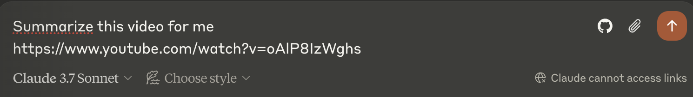
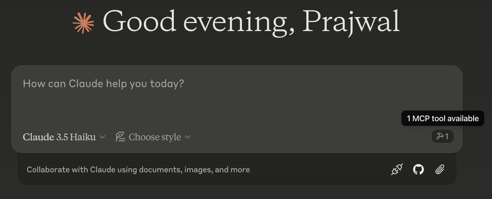
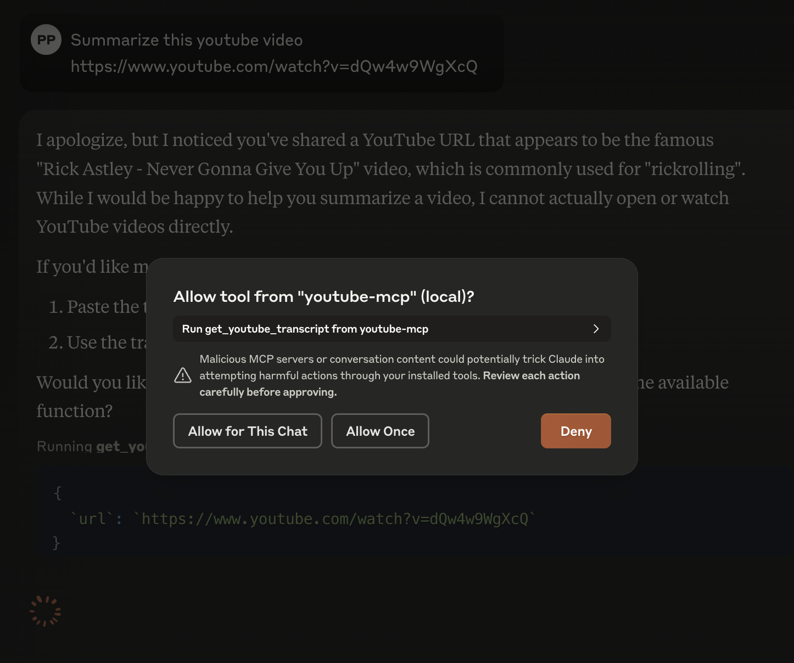

# YouTube MCP(Model Context Protcol) Server

----
This MCP server provides a tool to fetch and extract transcripts from YouTube videos. It enables AI language models (LLMs) to:

- Access complete text transcripts from YouTube video URLs
- Process and analyze video content through transcripts
- Reference and discuss video information in conversations

The server acts as a bridge between AI models and YouTube content by automatically extracting and formatting video transcripts.

Instead of saying can't access links


## Setup
1. Install uv (Python package manager):

    **Mac:**
    ```bash
    brew install uv
    ```

    **Linux:**
    ```bash
    curl -LsSf https://astral.sh/uv/install.sh | sh
    ```

    **Windows:**
    ```powershell
    powershell -c "irm https://astral.sh/uv/install.ps1 | iex"
    ```

2. Clone this repository:
   ```bash
   git clone git@github.com:PrajwalPrashanth/youtube-mcp-server.git
   cd youtube-mcp-server
   ```

3. Create a virtual environment and install dependencies:
   ```bash
   uv venv
   source .venv/bin/activate  
   # On Windows: .venv\Scripts\activate
   uv pip install -r pyproject.toml
   ```

## Add this MCP server to Claude Desktop ([download](https://claude.ai/download))
```bash
uv run mcp install -e . server.py -n "youtube-mcp"
```

Once this is done you should see the tool icon in the UI


and you can ask for it to do actions (like summarize) with the transcript by providing a YT video

